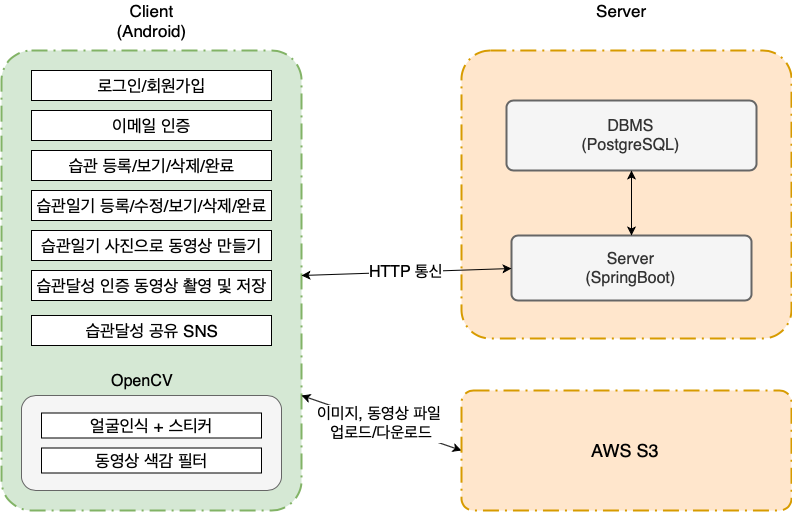

# GetHabit  
부산대학교 컴퓨터응용설계및실험 004분반 5팀 - 습관만들기 안드로이드 어플리케이션입니다.  
주요 기능들은 아래와 같습니다.
- 계정관리 (로그인, 로그아웃, 회원가입, 회원탈퇴, 이메일인증) 
- 습관 형성을 위한 습관 체크하기
- 습관 일기 쓰기
- 다른 사람들과 함께 습관만들기
Backend 서버 코드는 [여기](https://github.com/pnu-004-team5/CreatingHabits)에 있습니다.

## 구성도

## 데모영상
> 이미지 용량이 크므로 로딩이 오래 걸릴 수 있습니다 (약 13MB)

